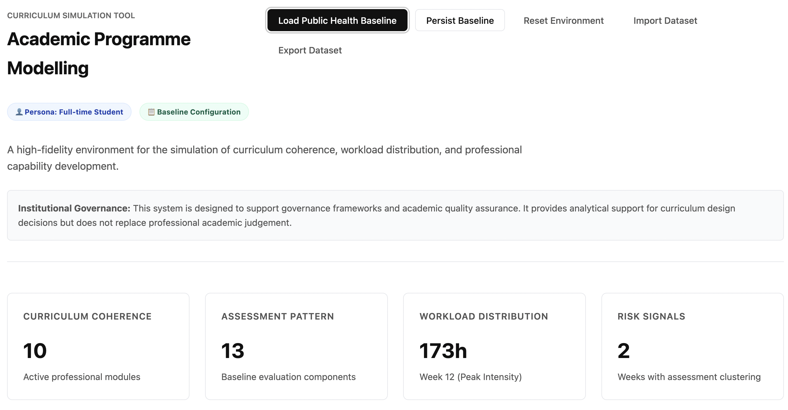

# Public Health & Health Systems: Curriculum Simulation Tool

A professional, local-first environment for the analysis and simulation of curriculum coherence, workload distribution, and professional capability development.

## 🔗 Role in the CloudPedagogy Ecosystem

**Phase:** Phase 1 — Curriculum Spine

**Role:**
Simulates curriculum behavior by modeling student workload, assessment congestion, and skill growth trajectories.

**Upstream Inputs:**
Structural curriculum data from the **Curriculum Alignment & Mapping Engine**.

**Downstream Outputs:**
Provides behavioral risk signals and scenario delta reporting to the **Programme Governance Dashboard**.

**Does NOT:**
- Define the baseline structural alignment of outcomes and assessments.
- Manage institutional governance workflows or individual human-AI decision records.


## 🚀 Overview

The **Curriculum Simulation Tool** is designed for programme teams, curriculum designers, and academic leadership to model and visualize high-fidelity curriculum scenarios. It provides deterministic modelling of student strain (workload), assessment variety, and competency scaffolding, supporting structured simulation and informed academic oversight.

🌐 **Live Hosted Version**
[http://cloudpedagogy-curriculum-simulation-tool.s3-website.eu-west-2.amazonaws.com/](http://cloudpedagogy-curriculum-simulation-tool.s3-website.eu-west-2.amazonaws.com/)

---

## 🖼️ Screenshot



---

## 📖 Features & Quick Start

2.  **Scenario Comparison**: Side-by-side analysis of Baseline vs Modified scenarios with impact delta calculation.
3.  **Governance Transparency**: Transparent simulation methodology and risk signals.
4.  **Student Persona Modelling**: Toggle between different study profiles (Full-time, Part-time, Intensive) to stress-test your curriculum.
5.  **Skill Trajectory Modelling**: Apply global growth models (Linear, Accelerated, Plateau) to visualize professional competency attainment.
6.  **Automated Risk Detection**: Detect workload spikes and assessment clustering automatically.

## 📊 Simulation Methodology & Thresholds

The tool uses the following default thresholds for structural risk detection:

### Workload Signals
- **Overload Peak**: > 45 hours total weekly workload.
- **Workload Spike**: > 15 hours increase in workload between adjacent weeks.
- **Sustained Intensity**: 3+ consecutive weeks of high (>35h) or overload intensity.

### Assessment Signals
- **Assessment Congestion**: 3 or more assessment deadlines in a single week (Critical).
- **High-Stakes Cluster**: Combined weight of assessments in a single week exceeds 50% (Critical).
- **Limited Diversity**: Fewer than 3 unique evaluation methods across the programme.

### Skill Growth Modelling
- **Linear**: Mastery increases by 20% per module exposure.
- **Accelerated**: Exponential mastery compounding (Practice leads to rapidly faster gains).
- **Plateau**: Rapid initial exposure benefits followed by diminishing returns at higher levels.

---

For full technical and operational details, please refer to the **[Detailed Instruction Manual](./INSTRUCTIONS.md)**.

---

## Capability and Governance

This tool supports both AI capability development and lightweight governance.

- Capability is developed through structured interaction with real workflows
- Governance is supported through optional fields that make assumptions, risks, and decisions visible

All governance inputs are optional and designed to support — not constrain — professional judgement.

---

## 🛠️ Development & Local Run

### Prerequisites
- Node.js (v18+)
- npm or pnpm

### Installation
```bash
git clone https://github.com/cloudpedagogy/cloudpedagogy-curriculum-simulation-tool.git
cd cloudpedagogy-curriculum-simulation-tool
npm install
```

### Running Locally
```bash
npm run dev
```

### Production Build
```bash
npm run build
npm run preview
```

---

🛡️ **Disclaimer**
This repository contains exploratory, framework-aligned tools developed for reflection, learning, and discussion.

These tools are provided as-is and are not production systems, audits, or compliance instruments. Outputs are indicative only and should be interpreted in context using professional judgement.

All applications are designed to run locally in the browser. No user data is collected, stored, or transmitted.

All example data and structures are synthetic and do not represent any real institution, programme, or curriculum.

📜 **Licensing & Scope**
This repository contains open-source software released under the MIT License.

CloudPedagogy frameworks and related materials are licensed separately and are not embedded or enforced within this software.

☁️ **About CloudPedagogy**
CloudPedagogy develops open, governance-credible resources for building confident, responsible AI capability across education, research, and public service.

**Website**: [https://www.cloudpedagogy.com/](https://www.cloudpedagogy.com/)
**Framework**: CloudPedagogy AI Capability Framework
